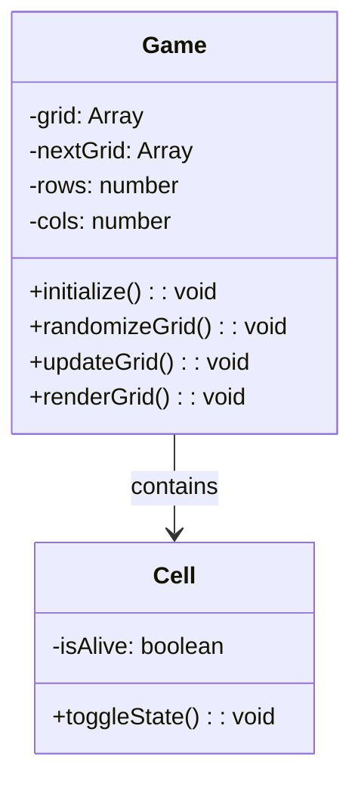

# steps & Topics

## Topics

Copilot Chat Cookbook - <https://docs.github.com/en/copilot/example-prompts-for-github-copilot-chat>

Copilot Chat

Copilot Edits - <https://code.visualstudio.com/docs/copilot/copilot-edits>

Using Copilot Chat in VS Code - <https://code.visualstudio.com/docs/copilot/copilot-chat>

How to use GitHub Copilot: Prompts, tips, and use cases - <https://github.blog/developer-skills/github/how-to-write-better-prompts-for-github-copilot/>

## Demo Flow

prompt in GitHub Copilot:

Create a static website in a single file that shows Conway's game of life in a responsive web page the full height and width of the device. The individual cells should be 10px squares on a white background. Use a 2px radius for rounding on the cells.

Windows: `CTRL`+`SHIFT`+`P`

Live Preview: Show Preview (External Browser)

Prompt in Editor:

Let's make it GitHub Themed. Can we make the squares green, and then lighter or darker dependent on the number of squares around it?
Use these specific hex values 9be9a8, 40c463, 30a14e, 216e39. New generation should be every 0.5s

---

Split in multiple files

Prompt:

Split the file into separate HTML, JavaScript and CSS

---

GitHub Copilot Instructions

Prompt: Refactor the code to make it more readable.

Links: <https://docs.github.com/en/copilot/customizing-copilot/adding-custom-instructions-for-github-copilot>

---

Slash Commands:

`ctrl`+`i`

/doc

/explain

Links:

- Inline Chat in Visual Studio Code - <https://code.visualstudio.com/docs/copilot/getting-started-chat#_stay-in-the-flow-with-inline-chat>
- Slash Commands in Visual Studio Code - <https://code.visualstudio.com/docs/copilot/copilot-chat#_slash-commands>

---

Using Copilot Edits to create a readme

Prompt:

Please take two steps in order:

1. Create walkthrough-README.md which contains the current contents of README.md.
2. Replace README.md and summarize the purpose of the repository, the current implementation and how users can contribute to it.

---

GitHub Copilot Extensions

<https://docs.github.com/en/copilot/using-github-copilot/using-extensions-to-integrate-external-tools-with-copilot-chat>

---

Prompt: 

@mermaid-chart Add a UML diagram to the README showing how the classes interact

Links:

About READMEs - <https://docs.github.com/en/repositories/managing-your-repositorys-settings-and-features/customizing-your-repository/about-readmes>

GitHub Copilot Chat documentation - <https://code.visualstudio.com/docs/copilot/copilot-chat>

GitHub Copilot Edits documentation - <https://code.visualstudio.com/docs/copilot/copilot-edits>

GitHub Copilot Extensions documentation - <https://docs.github.com/en/copilot/using-github-copilot/using-extensions-to-integrate-external-tools-with-copilot-chat>

Mermaid Chart extension for GitHub Copilot - <https://github.com/marketplace/mermaid-chart>
